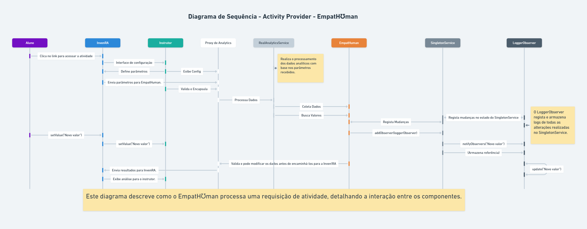

# EmpatHumanAPI

## Descrição do Projeto
O **EmpatHumanAPI** é uma aplicação desenvolvida para gerenciar e expor serviços analíticos e de configuração de atividades através de uma API REST. Foi implementado utilizando **Spring Boot**, empacotado em um contêiner **Docker**, e está hospedado em uma infraestrutura pessoal baseada em uma **Raspberry Pi 3-B**.

---

## **Padrões de Design Implementados**

### 1. Singleton (Padrão de Criação)
- **Classe**: `SingletonService`
- **Finalidade**:
  - Gerenciar valores persistentes compartilhados entre componentes da aplicação.
  - Notificar automaticamente os observadores sobre alterações no estado.
- **Exemplo de Uso**:
  - Endpoint `/singleton/update`: Atualiza o valor do Singleton e notifica os observadores.

### 2. Proxy (Padrão Estrutural)
- **Classe**: `AnalyticsServiceProxy`
- **Finalidade**:
  - Encapsular a lógica de controle e validação antes de delegar ao serviço real.
  - Garantir a integridade dos dados analisados pelo `RealAnalyticsService`.
- **Exemplo de Uso**:
  - Endpoint `/analytics`: Valida o `activityID` antes de processar os dados.
- **Nota**: Nesta versão, o `AnalyticsServiceProxy` foi atualizado com a anotação `@Primary`, priorizando a utilização da implementação do Proxy nos endpoints relacionados ao `AnalyticsService`.

### 3. Observer (Padrão Comportamental)
- **Classe**: `LoggerObserver`
- **Finalidade**:
  - Registrar mudanças no estado do `SingletonService`.
  - Implementar uma dependência "um-para-muitos", permitindo que múltiplos componentes sejam notificados automaticamente.
- **Exemplo de Uso**:
  - Notificações ao alterar o valor do Singleton via `/singleton/update`.

---

## Arquitetura Implementada

### DNS Público
O domínio público [`https://meiw.duckdns.org`](https://meiw.duckdns.org) foi configurado para acesso à aplicação e protegido por HTTPS. O certificado SSL é gerenciado pelo **Certbot** e fornecido pela **Let's Encrypt**.

### Reverse Proxy com Nginx
Um proxy reverso (**Nginx**) redireciona as requisições recebidas pelo domínio público para o contêiner Docker que executa a aplicação.

### Servidor Aplicacional
A aplicação está hospedada em uma **Raspberry Pi 3-B**, que foi configurada para operar como um servidor dedicado de baixo consumo energético.

### Gerenciamento com Docker
A aplicação foi empacotada em um contêiner Docker e é gerenciada com **Docker Compose**. Um script de automação via **Systemd** garante que o contêiner seja reiniciado automaticamente após falhas ou reinicializações.

---

## Acesso aos Serviços

### 1. Configuração da Atividade
- **Endpoint:** `GET /api/config`
- **Descrição:** Retorna uma página HTML com parâmetros de configuração da atividade.

**Exemplo de acesso:**
```bash
curl https://meiw.duckdns.org/api/config
```

---

### 2. Lista de Parâmetros de Configuração
- **Endpoint:** `GET /api/params`
- **Descrição:** Retorna os parâmetros configuráveis disponíveis para a página de configuração.

**Exemplo de acesso:**
```bash
curl https://meiw.duckdns.org/api/params
```
**Exemplo de resposta esperada:**
```json
[
  { "name": "difficulty", "type": "text/plain" },
  { "name": "timeLimit", "type": "integer" },
  { "name": "activityID", "type": "text/plain" }
]
```

---

### 3. Analytics de uma Atividade
- **Endpoint:** `POST /api/analytics`
- **Descrição:** Retorna dados de analytics para uma atividade específica.

**Body esperado:**
```json
{ "activityID": "12345" }
```

**Exemplo de acesso:**
```bash
curl -X POST https://meiw.duckdns.org/api/analytics \
     -H "Content-Type: application/json" \
     -d '{"activityID": "12345"}'
```
**Exemplo de resposta esperada:**
```text
Analytics data for activityID: 12345
```

---

### 4. Lista de Tipos de Analytics Disponíveis
- **Endpoint:** `GET /api/analytics/list`
- **Descrição:** Retorna os tipos de analytics qualitativos e quantitativos disponíveis.

**Exemplo de acesso:**
```bash
curl https://meiw.duckdns.org/api/analytics/list
```
**Exemplo de resposta esperada:**
```json
{
  "qualAnalytics": [
    { "name": "Student activity profile", "type": "URL" }
  ],
  "quantAnalytics": [
    { "name": "Acedeu à atividade", "type": "boolean" },
    { "name": "Evolução pela atividade (%)", "type": "integer" }
  ]
}
```

---

### 5. Preparar o Deploy de uma Atividade
- **Endpoint:** `GET /api/deploy`
- **Descrição:** Prepara o deploy de uma atividade e retorna a URL de acesso.

**Parâmetros:** `activityID` (string) (ex.: `?activityID=12345`)

**Exemplo de acesso:**
```bash
curl https://meiw.duckdns.org/api/deploy?activityID=12345
```
**Exemplo de resposta esperada:**
```json
{
  "message": "Activity deployed successfully!",
  "accessUrl": "https://meiw.duckdns.org/activity/start?activityID=12345",
  "singletonValue": "12345"
}
```

---

### 6. Obter Valor Atual do Singleton
- **Endpoint:** `GET /api/singleton/value`
- **Descrição:** Retorna o valor atual armazenado no SingletonService.

**Exemplo de acesso:**
```bash
curl https://meiw.duckdns.org/api/singleton/value
```
**Exemplo de resposta esperada:**
```json
{
  "singletonValue": "Valor inicial do SingletonService"
}
```

---

### 7. Atualizar Valor do Singleton
- **Endpoint:** `POST /api/singleton/update`
- **Descrição:** Atualiza o valor armazenado no SingletonService.

**Body esperado:**
```json
{ "value": "Novo valor do Singleton" }
```

**Exemplo de acesso:**
```bash
curl -X POST https://meiw.duckdns.org/api/singleton/update \
     -H "Content-Type: application/json" \
     -d '{"value": "Novo valor do Singleton"}'
```
**Exemplo de resposta esperada:**
```json
{
  "message": "Valor atualizado com sucesso",
  "newValue": "Novo valor do Singleton"
}
```
---

## Diagramas

### Diagrama de Componentes


### Diagrama de Sequência

---

## Autor
- **Rodrigo Costa**
  - Email: 2401857@estudante.uab.pt
  - Universidade Aberta

---

## Licença
Este projeto é de uso educacional e desenvolvido como parte do Mestrado em Engenharia Informática da Universidade Aberta.
